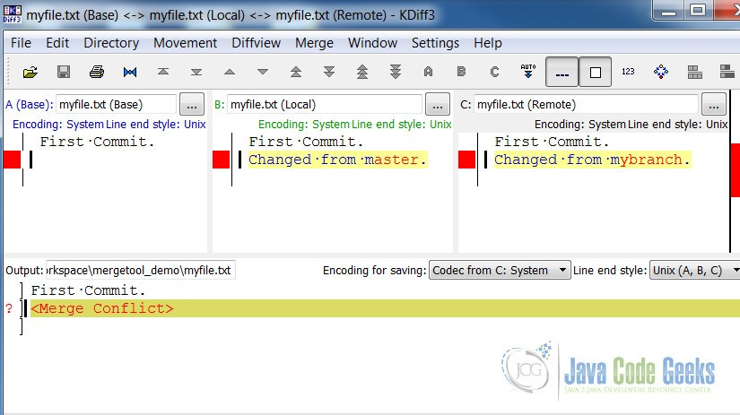

# Chapter 01: Intro, Diff & Patch

## 🎯 Key Concepts
- **Version Control**: Why it matters (traceability, collaboration, safety net)
- **Diff**: Comparing two versions of a file line-by-line
- **Patch**: A portable diff that can be applied to recreate changes

## 🔧 Commands Cheat Sheet
| Command | Purpose | Example |
|---------|---------|---------|
| `diff -u file1 file2` | Unified diff format | `diff -u old.txt new.txt` |
| `patch < change.patch` | Apply a patch to original | `patch -p1 < fix.patch` |
| `git diff` | Show unstaged changes | — |
| `kdiff3 file1 file2` | Visual side-by-side diff | `kdiff3 old.txt new.txt` |
| `kdiff3 -m a b c -o out` | 3-way merge with output | `kdiff3 -m base.txt mine.txt theirs.txt -o merged.txt` |

## 🖥️ Visual Tool: KDiff3

KDiff3 is a free, cross-platform GUI for comparing and merging files/directories.  
It shines when you need to **see** differences instead of reading raw `+/-` lines.

### Features at a glance
- Side-by-side or 3-pane comparison
- Line-level and character-level highlighting
- Built-in merge editor with conflict resolution
- Directory comparison (recursive)
- Integrates with Git as `mergetool` / `difftool`

### Example: 3-way merge view


> **Pane A** = Base (common ancestor)  
> **Pane B** = Local (your changes)  
> **Pane C** = Remote (incoming changes)  
> **Bottom** = Merged output — edit directly here to resolve conflicts

### Quick start
```bash
# Install (Debian/Ubuntu)
sudo apt install kdiff3

# Compare two files visually
kdiff3 original.txt modified.txt

# Use as Git mergetool
git config --global merge.tool kdiff3
git mergetool
```

## 💡 Key Takeaways

> **Diff is the language of code review.**  
> Understanding it manually makes Git diffs intuitive later.

> **Patches predate GitHub PRs.**  
> They were the original open-source contribution mechanism and remain useful for email-based workflows.

> **Visual tools bridge the learning gap.**  
> KDiff3 turns abstract `+/-` symbols into something visual — great for learning, but in real teams VS Code's built-in diff or GitHub's web UI are more common.


## 🛠️ Practice: WSL Path Converter

A small script to convert Windows paths to WSL-compatible paths.  
Demonstrates iterative improvement — a core concept in version control.

### Version 1: Basic Windows → WSL conversion
[`exercises/wsl-path-converter-v1.py`](./exercises/wsl-path-converter-base.py)

- Handles `C:\Users\...` → `/mnt/c/Users/...`
- ❌ Missing: UNC paths (`//wsl.localhost/...`)

### Version 2: Added UNC path support
[`exercises/wsl-path-converter-v2.py`](./exercises/wsl-path-converter-fixed.py)

- ✅ Handles both drive letters AND UNC paths
- ✅ Uses regex groups for clean extraction
- 💡 Key learning: Always consider edge cases before declaring "done"

### What changed between v1(base) and v2(fixed)?
```bash
diff -u exercises/wsl-path-converter-base.py exercises/wsl-path-converter-fixed.py
```

### What changed between v1 (base) and v2 (fixed)?

Full diff saved in [`exercises/results/wsl-path-diff.diff`](./exercises/results/wsl-path-diff.diff)

```diff
@@ -3,8 +3,14 @@

 dir_add = input("Enter directory path: ").strip("'\"")

-# Convert Windows path to WSL path
-if re.match(r"^[a-zA-Z]:[/\\]", dir_add):
+# Convert //wsl.localhost/<distro>/... → /...
+unc_match = re.match(r"^//wsl\.localhost/[^/]+(/.*)", dir_add, re.IGNORECASE)
+if unc_match:
+    dir_add = unc_match.group(1)
+    print(f"Converted UNC to: {dir_add}")
+
+# Convert Windows drive paths C:\... → /mnt/c/...
+elif re.match(r"^[a-zA-Z]:[/\\]", dir_add):
     drive = dir_add[0].lower()
     rest = dir_add[2:].replace("\\", "/")
     dir_add = f"/mnt/{drive}{rest}"
```

**💡 Notice how the original if became elif — this is exactly the kind of detail Git tracks in every commit.**


📄 **[View full diff with syntax highlighting](./exercises/results/wsl-path-diff.diff)**