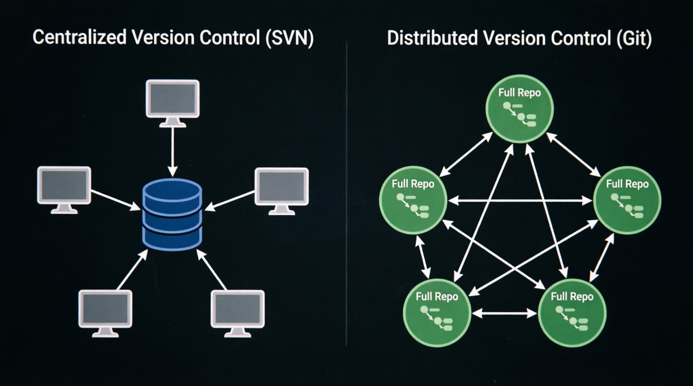
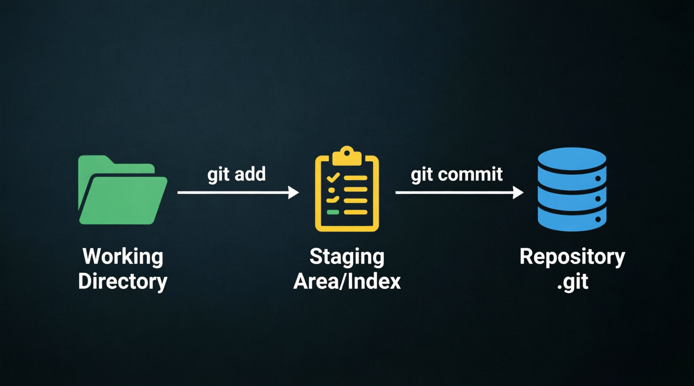

## 🔖 Version Control, Source Control & Git: Clearing the Confusion

### 1. What is Version Control?

Version Control is a **system that records changes to files over time**, enabling:

- 🔍 **Recall of specific versions** at any point
- 📜 **Full audit trail**: who changed what, when, and why
- 🛡️ **Safe rollback** without losing work
- 🌿 **Risk-free experimentation** on isolated branches

#### 💡 Real-world analogy: Google Docs Revision History

Google Docs automatically saves every edit. Users can:

- View complete version history with timestamps and authors
- Restore any previous state with a single click
- Compare two versions side-by-side

**Version Control Systems (VCS)** provide identical functionality for code — with significantly greater precision, speed, and structural control.

#### ❌ Without Version Control (The Chaos Approach)

```text
project/
├── main.py
├── main_backup.py
├── main_final.py
├── main_final_v2.py
├── main_REALLY_FINAL.py
└── main_working_copy_DO_NOT_DELETE.py
```

> Fragile, error-prone, and provides zero insight into what changed between iterations.

#### ✅ With Version Control (The Professional Approach)

```text
project/
├── main.py          ← Always the latest active working version
└── .git/            ← Hidden directory storing complete, immutable history
```

> Clean workspace. Full historical record. Instant rollback capability. This is the core value proposition of any VCS.

---

### 2. Version Control vs Source Control

In modern usage, **the terms are interchangeable**. Historical nuance exists but has no practical impact today:

| Term                     | Historical Origin                            | Original Scope                             | Modern Ecosystem Usage                                   |
| :----------------------- | :------------------------------------------- | :----------------------------------------- | :------------------------------------------------------- |
| **Version Control (VC)** | 1970s (`SCCS`, `RCS`)                        | Any digital asset: docs, configs, binaries | Generic, industry-standard umbrella term                 |
| **Source Control (SC)**  | 1990s Microsoft (`Visual SourceSafe`, `TFS`) | Specifically source code files             | Legacy enterprise term, still common in Microsoft stacks |

Microsoft popularized "Source Control" through Visual Studio and TFS. The open-source community consistently used "Version Control". Git documentation uses both interchangeably. Job postings use both randomly.

> 💡 **Practical guidance:** Use whichever term your team uses. When discussing code, either is correct. When tracking design files, documents, or datasets, **Version Control** is more accurate since "Source" implies source code specifically.

---

### 3. Git vs GitHub: Distinct Roles

These are frequently conflated but serve fundamentally different purposes in a developer's toolchain.

#### 🏗️ Architectural Relationship



> **Left (SVN/CVS):** Single central server holds all history. Clients are thin — no local history, no offline work.  
> **Right (Git):** Every developer has a full repository clone. All operations except push/pull are local and instant.

#### 🛠️ Git — The Engine (Local Tool)

- 🔌 Command-line program installed locally
- ⚡ Tracks changes line-by-line, stores history, and manages branches
- 🔒 Operates **100% offline** — zero network dependency
- ⚙️ Created by Linus Torvalds in 2005 for Linux kernel development
- 🏆 One implementation among several VCS tools (Mercurial, SVN, CVS exist — Git dominates)

```bash
# All commands below execute locally without internet:
git init                  # Initialize local repository
git add .                 # Stage changes for snapshot
git commit -m "feat: x"   # Record snapshot to .git directory
git log                   # Inspect local revision history
git branch feature-x      # Spin up isolated development line
```

#### ☁️ GitHub — The Platform (Cloud Hosting + Collaboration)

- 🌐 Web service hosting Git repositories remotely
- 🚀 Extends Git with features it lacks natively: Pull Requests, Issues, Actions (CI/CD), Wiki, Teams
- 🤝 Enables asynchronous collaboration: clone, fork, and contribute across organizational boundaries
- 🏢 Acquired by Microsoft in 2018
- 🔄 Popular alternatives: GitLab, Bitbucket, Codeberg, self-hosted Gitea

```bash
# Commands below require internet + authenticated account:
git push origin main      # Upload local commit tree to remote
git pull origin main      # Download remote changes to local repo
gh pr create              # Open Pull Request via GitHub CLI
```

#### 🏗️ Architectural Relationship

```text
┌─────────────────────────────────────────────────────────┐
│                      LOCAL MACHINE                      │
│  ┌──────────────────────────────────────────────────┐   │
│  │                   Git (engine)                   │   │
│  │  • init / add / commit                           │   │
│  │  • log / branch / merge                          │   │
│  │  • Fully offline-capable                         │   │
│  └─────────────────────────┬────────────────────────┘   │
└────────────────────────────┼────────────────────────────┘
                             │ push / pull
                             ▼
┌─────────────────────────────────────────────────────────┐
│               GITHUB (cloud platform)                   │
│  • Hosts .git repository remotely                       │
│  • Pull Requests, Code Reviews, Issues, CI/CD           │
│  • Team collaboration & permission management           │
│  • Network-dependent web interface                      │
└─────────────────────────────────────────────────────────┘
```

Git functions independently of GitHub. Many organizations use self-hosted GitLab exclusively. GitHub cannot function without Git — it is a hosting layer built atop the Git protocol. **Git is the underlying engine; GitHub is the platform built around it.**

#### 💡 Core Analogy

- **Git** = Word processor (creates and edits documents locally on your drive)
- **GitHub** = Cloud storage with collaboration features (stores documents remotely, enables real-time team sharing)

Documents exist without cloud storage. Cloud storage requires documents to host — and those documents originate from a word processor.

---

## ⚙️ Automation with Git: Beyond Manual Version Tracking

Git was architected from inception as a **machine-first tool**. Every design decision — from exit codes to output formats — anticipates programmatic consumption, not just human interaction.

### Why Automation Matters

Manual version control scales poorly. A solo developer can remember to commit, but:

- Teams of 10+ cannot coordinate without enforced workflows
- CI/CD pipelines require deterministic, scriptable interfaces
- Release processes demand reproducible, auditable steps
- Code quality gates must trigger automatically on every change

Git provides the substrate for all of these through three foundational properties:

#### 1. Predictable Exit Codes

Every Git command returns `0` on success and non-zero on failure. This enables shell scripts, Makefiles, and CI runners to make branching decisions without parsing human-readable output.

#### 2. Machine-Readable Output

The `--porcelain` flag guarantees stable, parseable output across Git versions. Unlike default output (which changes for human readability), porcelain format is a contract — safe to depend on in automation.

#### 3. Hook System

Git exposes lifecycle events (`pre-commit`, `post-receive`, `pre-push`, etc.) as executable scripts. These enforce policies at the point of action: linting before commit, deployment after push, access control on receive.

### Where Git Automation Lives in Practice

| Layer                     | Git's Role                                       | Real-World Example                                                    |
| ------------------------- | ------------------------------------------------ | --------------------------------------------------------------------- |
| **Local Developer**       | Enforce standards before code leaves machine     | `pre-commit` hooks run formatters, linters, secret scanners           |
| **CI Pipeline**           | Trigger builds/tests on every push               | GitHub Actions reads commit metadata to decide test matrix            |
| **CD Pipeline**           | Deploy specific commits to environments          | ArgoCD syncs cluster state to a Git tag or branch HEAD                |
| **Release Engineering**   | Generate changelogs, bump versions, tag releases | `semantic-release` parses conventional commits to automate versioning |
| **Security & Compliance** | Audit trail, policy enforcement, rollback        | Signed commits + protected branches satisfy SOC2/GDPR requirements    |

### The Plumbing vs Porcelain Distinction

Git commands split into two categories:

- **Porcelain**: High-level, user-friendly commands (`git commit`, `git status`, `git log`). Designed for humans. Output may change between versions.
- **Plumbing**: Low-level, stable commands (`git hash-object`, `git cat-file`, `git update-ref`, `git rev-parse`). Designed for scripts and other tools. Output format is part of Git's API contract.

Automation relies on plumbing. When you write a script that interacts with Git, porcelain commands are fragile; plumbing commands are reliable. This separation is intentional — Git's creators built the plumbing layer first, then wrapped it in porcelain for daily use.

> 💡 **Key insight:** Git is not merely a tool developers use manually. It is infrastructure. Modern DevOps pipelines treat the Git repository as the single source of truth for application state, configuration, and deployment manifests. Every automated workflow — from testing to production rollout — ultimately reduces to reading Git history and acting on it.

This is why learning Git deeply pays dividends far beyond "saving code". Understanding its automation surface unlocks CI/CD, GitOps, release engineering, and platform engineering workflows that define modern software delivery.

---

## 🔄 The Three-State Model



This is the **single most important mental model** in Git. Every command maps to a transition between these states.

| State         | Location                     | Command to Enter | What It Means                       |
| ------------- | ---------------------------- | ---------------- | ----------------------------------- |
| **Modified**  | Working Directory            | Edit a file      | Changed but not yet staged          |
| **Staged**    | Index (`.git/index`)         | `git add`        | Marked for inclusion in next commit |
| **Committed** | Repository (`.git/objects/`) | `git commit`     | Safely stored in permanent history  |

### Why Two Steps (add + commit)?

Unlike SVN's single `commit`, Git separates **selection** from **recording**:

- Stage only the changes you want in _this_ commit (partial commits)
- Review exactly what will be committed before finalizing (`git diff --cached`)
- Build atomic, logical commits instead of "everything I did today" dumps
- Enables interactive staging (`git add -p`) for surgical precision

> 💡 **Key insight:** The staging area is Git's superpower. It enables atomic commits, partial staging, and pre-commit review — capabilities centralized VCS lack entirely. Understanding this flow is prerequisite to everything that follows in this course.

---

## ✅ Ready to Test Your Understanding?

Completed the concepts above? Validate your knowledge with the chapter quiz:

👉 **[Chapter 02 Quiz](./quiz.md)** — 5 conceptual questions covering Version Control, Git vs GitHub, Three-State Model, Automation, and Distributed Architecture.
